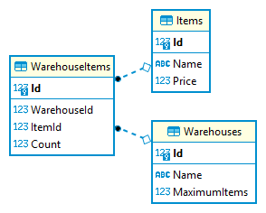

# WarehouseManagementSystem

The system provides next functionality:
- view list of warehouses, items and warehouse items
- add or edit an item with particular price
- add, edit or delete an item to/from warehouse with particular amount

Note. Warehouses, Items and WarehouseItems -- are different tables.

Requirements:
- .NET Core
- EF Core
- PostgreSQL
- only server side (WebAPI controllers)
- integration tests (webhost, xUnit)
- OOP and SOLID principles

# PostgreSQL

## Diagram



## Initial Data
### Items

| Id | Name | Price |
|:--:|:----:|:-----:|
| 1 | pencil | 10.00
| 2 | pen | 20.00
| 3 | felt-tip pen | 30.00

### Warehouses

| Id | Name | MaximumItems |
|:--:|:----:|:------------:|
| 1 | miniature | 100
| 2 | decent | 10000
| 3 | hefty | 1000000

### WarehouseItems

| Id | WarehouseId | ItemId | Count |
|:--:|:-----------:|:------:|:------:
| 1 | 1 | 1 | 50
| 2 | 2 | 2 | 5000
| 3 | 3 | 3 | 500000

# Docker

- db-data
  - volume for docker-compose
  - for database recreating should be removed manually

# curl
## Warehouses
### GET
```
curl -i -H "Content-Type: application/json" -X GET http://localhost:8080/api/warehouses
curl -i -H "Content-Type: application/json" -X GET http://localhost:8080/api/items/1
curl -i -H "Content-Type: application/json" -X GET http://localhost:8080/api/items/999
```

## Items
### GET
```
curl -i -H "Content-Type: application/json" -X GET http://localhost:8080/api/items
curl -i -H "Content-Type: application/json" -X GET http://localhost:8080/api/items/1
```

### POST
```
curl -i -H "Content-Type: application/json" -X POST http://localhost:8080/api/items -d @"payload/CreateItem.json"
curl -i -H "Content-Type: application/json" -X POST http://localhost:8080/api/items -d @"payload/CreateItemWithId.json"
curl -i -H "Content-Type: application/json" -X POST http://localhost:8080/api/items -d @"payload/CreateItemWithNegativePrice.json"
```

### PUT
```
curl -i -H "Content-Type: application/json" -X PUT http://localhost:8080/api/items -d @"payload/UpdateItem.json"
curl -i -H "Content-Type: application/json" -X PUT http://
localhost:8080/api/items -d @"payload/UpdateItemWithIncorrectId.json"
curl -i -H "Content-Type: application/json" -X PUT http://localhost:8080/api/items -d @"payload/UpdateItemWithIncorrectData.json"
```

## WarehouseItems
### GET
```
curl -i -H "Content-Type: application/json" -X GET http://localhost:8080/api/WarehouseItems
curl -i -H "Content-Type: application/json" -X GET http://localhost:8080/api/WarehouseItems/1
```

### POST
```
curl -i -H "Content-Type: application/json" -X POST http://localhost:8080/api/warehouseitems -d @"payload/CreateWarehouseItem.json"
curl -i -H "Content-Type: application/json" -X POST http://localhost:8080/api/warehouseitems -d @"payload/CreateWarehouseItemWithId.json"
curl -i -H "Content-Type: application/json" -X POST http://localhost:8080/api/warehouseitems -d @"payload/CreateWarehouseItemWithNegativeCount.json"
```

### PUT
```
curl -i -H "Content-Type: application/json" -X PUT http://localhost:8080/api/warehouseitems -d @"payload/UpdateWarehouseItem.json"
curl -i -H "Content-Type: application/json" -X PUT http://localhost:8080/api/warehouseitems -d @"payload/UpdateWarehouseItemWithIncorrectId.json"
curl -i -H "Content-Type: application/json" -X PUT http://localhost:8080/api/warehouseitems -d @"payload/UpdateWarehouseItemWithIncorrectIds.json"
curl -i -H "Content-Type: application/json" -X PUT http://localhost:8080/api/warehouseitems -d @"payload/UpdateWarehouseItemWithIncorrectData.json"
```

### DELETE
```
curl -i -H "Content-Type: application/json" -X DELETE http://localhost:8080/api/warehouseitems/1
curl -i -H "Content-Type: application/json" -X DELETE http://localhost:8080/api/warehouseitems/999
```